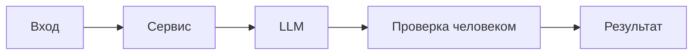

# ADR: решение для первого рабочего сценария

Файл ведёт OpenCode. Обсудите с агентом содержание и проверьте предложенный diff. Все дополнения и исправления поручайте агенту в чате.

- Статус: proposed / accepted
- Дата: 2026-09-11
- Ответственные: команда практики

## Контекст

Нужно обеспечить воспроизводимый и проверяемый ответ AI-помощника по учебному diff с соблюдением правил CASE (OUT-1, SEC-1, API-1, REL-1, OBS-1, SCOPE-1, QA-1).
## Решение

Использовать master prompt с Context Pack, в котором перечислены только релевантные правила и формат результата. Ответ ограничить структурой summary/risks/checks, риски — максимум три и только подтверждённые.
## Рассмотренные альтернативы

| Альтернатива | Почему не выбрали сейчас |
|---|---|
| Zero-shot без контекста | Недостаточная доказательность, домыслы |

## Последствия и главный риск

- Положительные последствия:
- Ограничения: нельзя выходить за SCOPE-1, нельзя использовать внешние источники
- Главный риск: перенос нерелевантных правил в контекст
- Как проверим риск: сверка Context Pack с CASE.md и prompts.md

## Архитектурная схема

## Как использовали AI

- Для чего: зафиксировать выбранный подход (master prompt + Context Pack).
- Тип промпта: master prompt.
- Строка в [`prompts.md`](prompts.md): P1-02.
- Что проверили и исправили сами: выбрали минимальный набор правил, соответствующий CASE.
