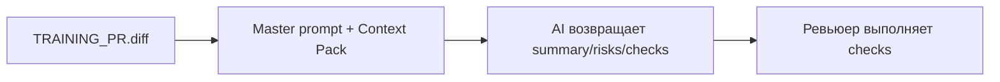

# Анализ процесса: AS IS и TO BE

## AS IS

Студент отправляет zero-shot запрос с одним входом (TRAINING_PR.diff). AI возвращает общий ответ без строгого формата; отсутствуют ссылки на строки и воспроизводимые проверки. Ревьюер тратит время на перепроверку.

## TO BE

Тот же вход, но запускается по master prompt с Context Pack, содержащим правила CASE и формат OUT-1. Ответ содержит summary, ≤3 риска с file:line,evidence,risk и список checks.

## Разница

| Что меняется | AS IS | TO BE | Как проверим изменение |
|---|---|---|---|
| Формат ответа | Свободный | OUT-1: summary/risks/checks | Проверка схемы ответа |
| Доказательность | Без ссылок | file:line + evidence | Сопоставить с diff |
| Воспроизводимость | Нет checks | Есть checks на SEC-1/API-1/OUT-1 | Повторить шаги |

## Как использовали AI

- Для чего: описать переход от zero-shot к master prompt.
- Тип промпта: master prompt (контракт шагов и DoD).
- Строка в [`prompts.md`](prompts.md): P1-02.
- Что проверили и исправили сами: сопоставили изменения с CASE/README; убрали лишние предположения.
