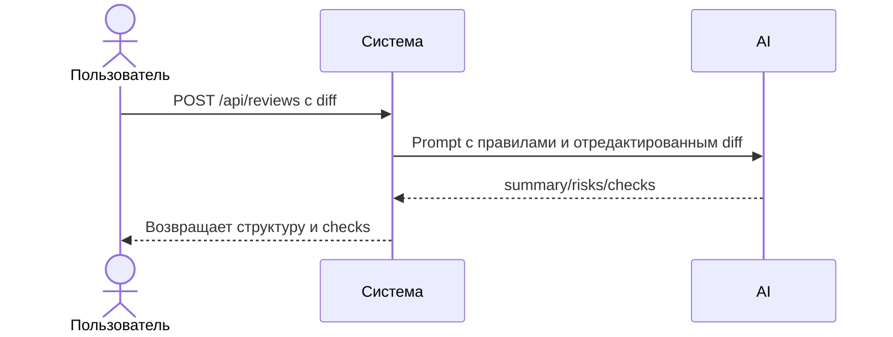

# Use cases и user stories

Файл ведёт OpenCode. Обсудите с агентом содержание и проверьте предложенный diff. Все дополнения и исправления поручайте агенту в чате.

## Первый рабочий сценарий

Когда у студента есть TRAINING_PR.diff, система принимает diff и возвращает краткое резюме изменений, до трёх подтверждённых рисков с ссылками и список проверок; пользователь получает воспроизводимые шаги для валидации.

Не входит в этот сценарий:

- Редактирование исходного кода; действия в GitHub; расширение входов вне CASE.

## Use case

| Поле | Значение |
|---|---|
| Актор | Студент/ревьюер |
| Триггер | Появился учебный diff |
| Предусловия | Настроен OpenCode, доступен TRAINING_PR.diff |
| Основной результат | Ответ в формате OUT-1: summary/risks/checks |
| Ошибка или отказ | Diff > 20 000 символов (413) или таймаут внешнего вызова |



## User stories и acceptance criteria

```gherkin
Feature:

  Scenario: Позитивный
    Given учебный diff ≤ 20 000 символов
    When запускаем master prompt
    Then получаем summary и ≤ 3 риска с file:line,evidence,risk и checks

  Scenario: Негативный или граничный
    Given diff длиной 20001 символ
    When отправляем на обработку
    Then получаем отклонение по API-1 (413)
```

## Как использовали AI

- Для чего: формализовать сценарий использования AI-помощника.
- Тип промпта: master prompt с Context Pack.
- Строка в [`prompts.md`](prompts.md): P1-02.
- Что проверили и исправили сами: сценарии соответствуют CASE и OUT-1.
