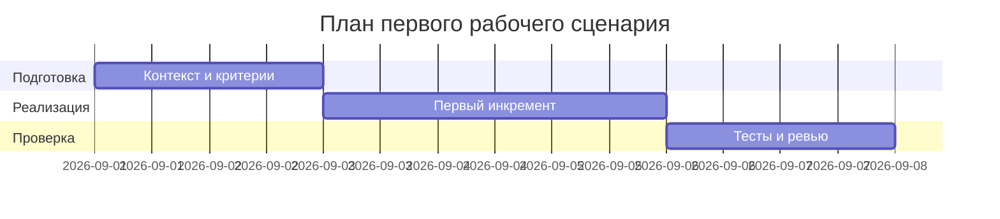

# План поставки

Файл ведёт OpenCode. Обсудите с агентом содержание и проверьте предложенный diff. Все дополнения и исправления поручайте агенту в чате.

## Инкременты и ответственность

| Инкремент | Наблюдаемый результат | Что делает человек | Что делает AI или субагент | Проверка | Зависимости |
|---|---|---|---|---|---|
| 1 | Собран Context Pack и master prompt v1 | Ставит ссылки на CASE/README | Формирует структуру OUT-1 | Проверка по DoD | CASE, README |
| 2 | Получен ответ P1-02 | Запускает мастер-промпт | Возвращает summary/risks/checks | Сопоставление с diff | TRAINING_PR.diff |
| 3 | Обновлены артефакты | Вносит правки | — | Наличие разделов «Как использовали AI» | prompts.md |

## Диаграмма Ганта

Передайте OpenCode даты и задачи своего плана и попросите обновить диаграмму.

## Как использовали AI

- Для чего: определить поставку инкрементов практики.
- Тип промпта: master prompt.
- Строка в [`prompts.md`](prompts.md): P1-02.
- Что проверили и исправили сами: план соотнесён с DoD из CASE/README.
